```mermaid
graph LR
    A[Python Fundamentals] --> B[Probability]
    B --> C[Sampling]
    C --> D[Hypothesis Testing]
    D --> E[ANOVA]
    E --> F[Regression]
    F --> G[Logistic Regression]
    G --> H[Model Building]
    H --> I[Cluster Analysis]
    
    style A fill:#d1f0ff,stroke:#0077b6
    style B fill:#d1f0ff,stroke:#0077b6
    style C fill:#d1f0ff,stroke:#0077b6
    style D fill:#ffe5d9,stroke:#f4a261
    style E fill:#ffe5d9,stroke:#f4a261
    style F fill:#e9ecef,stroke:#6c757d
    style G fill:#e9ecef,stroke:#6c757d
    style H fill:#e9ecef,stroke:#6c757d
    style I fill:#d8f3dc,stroke:#2d6a4f
```

# 📊 Data Analytics with Python - NPTEL Course 🐍

  

  
  
  
  

  
<b>🎓 Course Review:</b> 

## 📋 Course Overview

This repository contains materials for the NPTEL course "Data Analytics with Python," including code examples, assignments, and resources for statistical analysis and machine learning.

## 🗓️ Course Layout

<table>
  <tr>
    <th width="100">Week</th>
    <th>Topics</th>
    <th width="70">Status</th>
  </tr>
  <tr>
    <td align="center">📍 Week 1</td>
    <td>Introduction To Data Analytics And Python Fundamentals</td>
    <td align="center">✅</td>
  </tr>
  <tr>
    <td align="center">📍 Week 2</td>
    <td>Introduction To Probability</td>
    <td align="center">✅</td>
  </tr>
  <tr>
    <td align="center">📍 Week 3</td>
    <td>Sampling And Sampling Distributions</td>
    <td align="center">✅</td>
  </tr>
  <tr>
    <td align="center">📍 Week 4</td>
    <td>Hypothesis Testing</td>
    <td align="center">✅</td>
  </tr>
  <tr>
    <td align="center">📍 Week 5</td>
    <td>Two Sample Testing And Introduction To ANOVA</td>
    <td align="center">✅</td>
  </tr>
  <tr>
    <td align="center">📍 Week 6</td>
    <td>Two-Way ANOVA And Linear Regression</td>
    <td align="center">✅</td>
  </tr>
  <tr>
    <td align="center">📍 Week 7</td>
    <td>Linear Regression And Multiple Regression</td>
    <td align="center">✅</td>
  </tr>
  <tr>
    <td align="center">📍 Week 8</td>
    <td>Concepts Of MLE And Logistic Regression</td>
    <td align="center">✅</td>
  </tr>
  <tr>
    <td align="center">📍 Week 9</td>
    <td>ROC And Regression Analysis Model Building</td>
    <td align="center">✅</td>
  </tr>
  <tr>
    <td align="center">📍 Week 10</td>
    <td>C2 Test And Introduction To Cluster Analysis</td>
    <td align="center">✅</td>
  </tr>
</table>

## 🎯 Learning Path

## 📝 Assignment Solutions (Previous Course)

<table>
  <tr>
    <th width="150">Week</th>
    <th>Solution Link</th>
    <th width="100">Status</th>
  </tr>
  <tr>
    <td>📝 Week 1</td>
    <td></td>
    <td>✅ Available</td>
  </tr>
  <tr>
    <td>📝 Week 2</td>
    <td></td>
    <td>✅ Available</td>
  </tr>
  <tr>
    <td>📝 Week 3</td>
    <td></td>
    <td>✅ Available</td>
  </tr>
  <tr>
    <td>📝 Week 4</td>
    <td></td>
    <td>✅ Available</td>
  </tr>
  <tr>
    <td>📝 Week 5</td>
    <td></td>
    <td>✅ Available</td>
  </tr>
  <tr>
    <td>📝 Week 6</td>
    <td></td>
    <td>✅ Available</td>
  </tr>
  <tr>
    <td>📝 Week 7</td>
    <td></td>
    <td>✅ Available</td>
  </tr>
  <tr>
    <td>📝 Week 8</td>
    <td>Coming soon!</td>
    <td>⏳ Pending</td>
  </tr>
  <tr>
    <td>📝 Week 9</td>
    <td>Coming soon!</td>
    <td>⏳ Pending</td>
  </tr>
  <tr>
    <td>📝 Week 10</td>
    <td></td>
    <td>✅ Available</td>
  </tr>
  <tr>
    <td>📝 Week 11</td>
    <td>Coming soon!</td>
    <td>⏳ Pending</td>
  </tr>
  <tr>
    <td>📝 Week 12</td>
    <td>Coming soon!</td>
    <td>⏳ Pending</td>
  </tr>
</table>

### 📺 YouTube Playlist
[Complete NPTEL Course Videos](https://youtu.be/cmRkGyrcsrI)

### 👨‍👩‍👧‍👦 Join Our Study Group

## 📚 Week 1: Introduction To Data Analytics And Python Fundamentals

  <table>
    <tr>
      <th width="300">Resource</th>
      <th>Link</th>
    </tr>
    <tr>
      <td>🎬 Assignment solution</td>
      <td></td>
    </tr>
    <tr>
      <td>🧩 Practice Questions</td>
      <td></td>
    </tr>
    <tr>
      <td>📝 Summary of Week-1</td>
      <td></td>
    </tr>
    <tr>
      <td>📊 Central Tendency and Dispersion</td>
      <td></td>
    </tr>
    <tr>
      <td>💻 How to Run Python Notebook Online</td>
      <td></td>
    </tr>
  </table>

## 🧮 Statistical Tools & References

  <table>
    <tr>
      <th>Tool</th>
      <th>Description</th>
      <th>Link</th>
    </tr>
    <tr>
      <td>📈 Z-table</td>
      <td>Standard normal distribution table</td>
      <td><a href="https://www.ztable.net/">Access Z-table</a></td>
    </tr>
    <tr>
      <td>🧮 Z-score Calculator</td>
      <td>Calculate Z-scores easily</td>
      <td><a href="https://www.calculator.net/z-score-calculator.html">Use Calculator</a></td>
    </tr>
    <tr>
      <td>📊 T-table</td>
      <td>Student's t-distribution table</td>
      <td><a href="https://www.tdistributiontable.com/">Access T-table</a></td>
    </tr>
    <tr>
      <td>🧮 T-value Calculator</td>
      <td>Calculate T-values easily</td>
      <td><a href="https://goodcalculators.com/student-t-value-calculator/">Use Calculator</a></td>
    </tr>
  </table>

## 📌 Key Topics Covered

  <table>
    <tr>
      <td align="center" width="100"></td>
      <td align="center" width="100"></td>
      <td align="center" width="100"></td>
      <td align="center" width="100"></td>
    </tr>
    <tr>
      <td align="center">Arrays & Matrix Operations</td>
      <td align="center">Data Manipulation</td>
      <td align="center">Data Visualization</td>
      <td align="center">Hypothesis Testing</td>
    </tr>
  </table>

<blockquote>
  
💡 <strong>Course Tip:</strong> Focus on understanding statistical concepts first, then learn how to implement them in Python. The combination of theoretical knowledge and practical coding skills will make you proficient in data analytics.

</blockquote>

## 🙏 Credits

  
NPTEL Video Playlist: <a href="https://youtube.com/playlist?list=PLLy_2iUCG87CNafffzNZPVa9rW-QmOmEv&si=bscrB6uSG308P1XJ">Watch all lectures</a>

  
Repository maintained by <a href="https://github.com/Yash-Kavaiya">Yash Kavaiya</a>

---

  
⭐ Star this repository if you find it helpful! ⭐

  
📚 Happy Learning and Data Analysis! 📊

